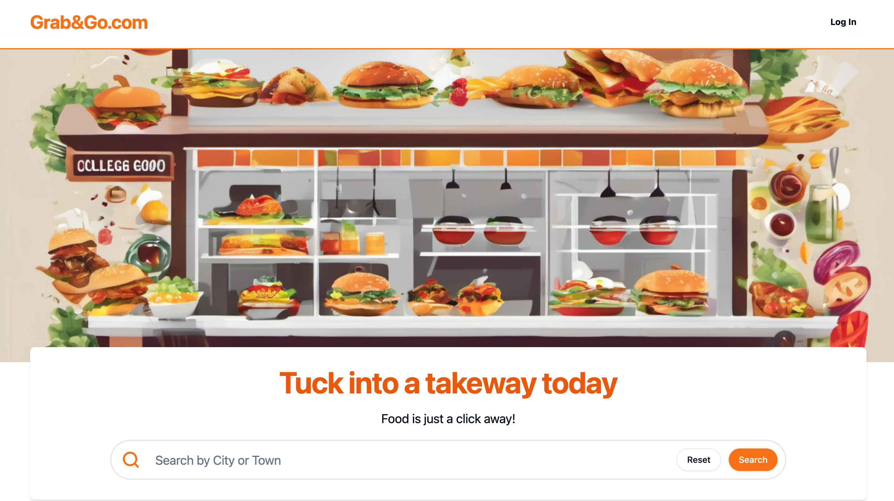
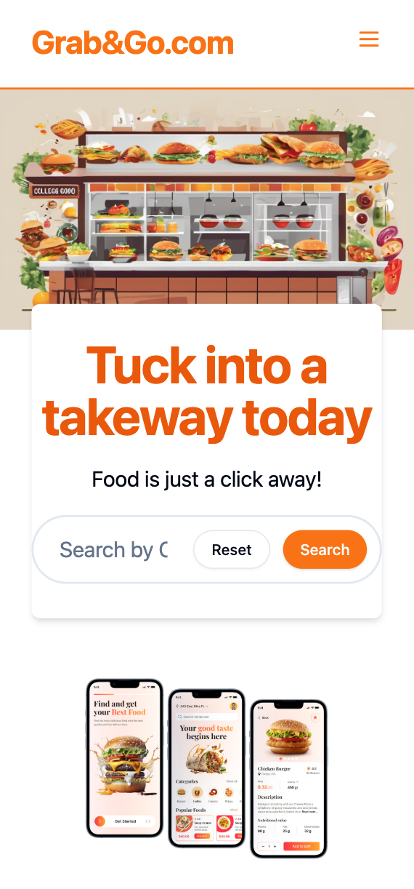
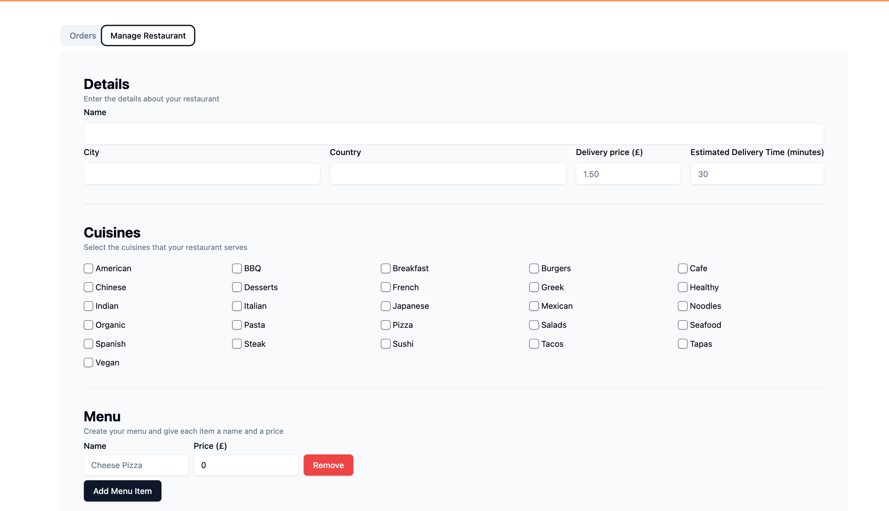
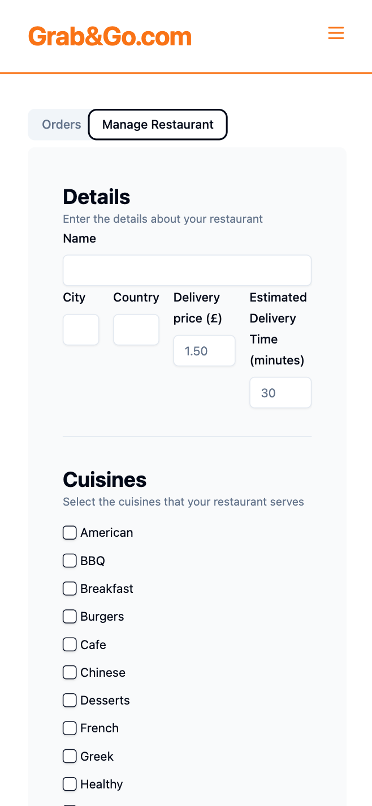

## Grab & Go – Frontend

This repository contains the **deployed frontend** for the **Grab & Go** food ordering platform.

The project was developed as part of the **Avishkar Dev & Die** and **Innodev** hackathons and has since been structured to follow a more **industry-style separation** of frontend and backend.

- **Live frontend:** https://grab-go-frontend-deploy.onrender.com/
- **Backend repository:** https://github.com/ShaanKapoor10/Backend

The backend exposes REST APIs for restaurants, orders, and user management, while this app provides the full customer and restaurant-owner UI.

---

## Project Images / Screenshots

<div>
    <div classname = "flex flex-col md:flex-row">
        
        
    </div>
    <p>Home page</p>
    <div classname = "flex flex-col md:flex-row">
        
        
    </div>
    <p>Manage restaurant page</p>
</div>


---
## Features

- **Public experience**
  - Landing page with hero section and city-based search
  - Search restaurants by **city**, **cuisine**, and **sorting option**
  - Paginated restaurant search results with rich restaurant cards
  - Restaurant **detail page** with:
    - Menu listing
    - Add-to-cart functionality
    - Order summary and checkout flow

- **Authentication & users**
  - Auth handled via **Auth0** SPA integration
  - New users are automatically created in the backend after Auth0 login
  - Protected routes using a `ProtectedRoute` wrapper

- **Customer features (authenticated)**
  - **User profile** page with:
    - Name, address, city, country, and email fields
    - Update profile using a form backed by the API
  - **Order status** page:
    - List of user orders
    - Detailed order info and visual restaurant image for each order
    - Order status progress based on configured status steps

- **Restaurant owner features (authenticated)**
  - **Manage restaurant** page with tabs:
    - **Orders**: View active orders for the restaurant
    - **Manage restaurant**: Create or update restaurant details, including menu and image
  - Ability to **update order status** for orders placed at the restaurant

- **UI & UX**
  - Responsive layout using **Tailwind CSS**
  - Shared `Layout` with `Header`, optional `Hero`, and `Footer`
  - Toast notifications for success/error states (using `sonner`)
  - Simple and consistent design using Radix UI primitives and custom components

---

## Tech Stack

- **Framework**: React 18 + TypeScript
- **Bundler/Dev server**: Vite
- **Styling**: Tailwind CSS (+ `tailwind-merge`, `tailwindcss-animate`)
- **Routing**: `react-router-dom` (v6)
- **Data fetching & caching**: `react-query`
- **Auth**: `@auth0/auth0-react`
- **Forms & validation**:
  - `react-hook-form`
  - `zod`
  - `@hookform/resolvers`
- **UI components**:
  - Radix UI (`@radix-ui/react-*`)
  - `lucide-react`
- **Notifications**: `sonner`

---

## Project Structure (high level)

```text
src/
  api/                    # API hooks for backend communication
  assets/                 # Images (landing, app download, etc.)
  auth/                   # Auth0 provider wrapper, protected routes
  components/             # Reusable UI components
  config/                 # App configuration (cuisines, order statuses)
  forms/                  # Form components & schemas (user profile, restaurant)
  layouts/                # Layout component with header/footer/hero
  pages/                  # Route-level pages
  lib/                    # Shared utilities (if any)
  types.ts                # Shared TypeScript types
  AppRoutes.tsx           # React Router route configuration
  main.tsx                # App entry point and provider setup
  global.css              # Tailwind base styles
```

### Key Pages & Routes

- `/`
  Home page with hero, city search, and promotional content.

- `/search/:city`
  - Filters: cuisines, search term, sort options.
  - Paginated results using `PaginationSelector`.

- `/detail/:restaurantId`
  - Restaurant header & hero image.
  - Menu listing (`MenuItem` components).
  - Cart management and order summary.
  - Checkout flow (creates a checkout session via backend).

- `/auth-callback`
  - Called after Auth0 redirects back.
  - Creates the user in the backend if not already present.
  - Redirects to `/`.

- Protected routes (via `ProtectedRoute`):
  - `/user-profile` – view and update user profile.
  - `/order-status` – view all user orders and their status.
  - `/manage-restaurant` – for restaurant owners to manage restaurant and orders.

---

## Environment Variables

This project uses **Vite** environment variables. They must start with `VITE_` and be defined in a file such as `.env.local` at the project root.

Required variables:

```bash
VITE_AUTH0_DOMAIN=your-auth0-domain
VITE_AUTH0_CLIENT_ID=your-auth0-client-id
VITE_AUTH0_CALLBACK_URL=your-auth0-callback-url
VITE_AUTH0_AUDIENCE=your-auth0-api-audience

VITE_API_BASE_URL=https://your-backend-base-url
```

**Notes:**

- `VITE_AUTH0_DOMAIN`  
  Your Auth0 tenant domain, e.g. `dev-xyz123.us.auth0.com`.

- `VITE_AUTH0_CLIENT_ID`  
  Client ID of your SPA application in Auth0.

- `VITE_AUTH0_CALLBACK_URL`  
  The URL Auth0 redirects back to after login.  
  Typically for local dev this would be something like `http://localhost:5173/auth-callback` (if using the default Vite dev port).  
  This must be registered in **Allowed Callback URLs** in your Auth0 application settings.

- `VITE_AUTH0_AUDIENCE`  
  The Auth0 API audience corresponding to your protected backend API.

- `VITE_API_BASE_URL`  
  Base URL of the backend API (e.g. `http://localhost:5000` in development or your deployed backend URL in production).

---

## Getting Started (Local Development)

### Prerequisites

- **Node.js** ≥ 18 (recommended for Vite 5)
- **npm** (or another compatible package manager)

### 1. Clone the repository

```bash
git clone https://github.com/ShaanKapoor10/Grab-Go-FrontEnd-Deploy.git
cd Grab-Go-FrontEnd-Deploy
```

### 2. Install dependencies

```bash
npm install
```

### 3. Configure environment variables

Create a `.env.local` file in the project root:

```bash
VITE_AUTH0_DOMAIN=your-auth0-domain
VITE_AUTH0_CLIENT_ID=your-auth0-client-id
VITE_AUTH0_CALLBACK_URL=http://localhost:5173/auth-callback
VITE_AUTH0_AUDIENCE=your-auth0-api-audience
VITE_API_BASE_URL=http://localhost:5000
```

Make sure:

- The callback URL matches the route served by this app (`/auth-callback`).
- `VITE_API_BASE_URL` points to your **running backend** (see the backend repo for its setup).

### 4. Run the development server

```bash
npm run dev
```

By default, Vite serves on `http://localhost:5173/`. Open that URL in your browser.

---

## Available Scripts

All scripts are defined in `package.json`.

- **`npm run dev`**  
  Starts the Vite development server with hot module reloading.

- **`npm run build`**  
  Type-checks the project (`tsc`) and builds the production bundle via Vite.

- **`npm run preview`**  
  Serves the production build locally for testing.

- **`npm run lint`**  
  Runs ESLint over `.ts` and `.tsx` files.

---

## How It Works (High-Level Flow)

- **App initialization**
  - `main.tsx` wraps the app with:
    - `BrowserRouter` (React Router)
    - `QueryClientProvider` (React Query)
    - `Auth0ProviderWithNavigate` (Auth0 SPA + navigation callback)
    - `Toaster` (notifications)
  - `AppRoutes` defines routing and applies `Layout` and `ProtectedRoute` as needed.

- **Auth0 integration**
  - `Auth0ProviderWithNavigate` reads Auth0 config from Vite env vars.
  - On login redirect, it sends the user to `/auth-callback`.
  - `AuthCallbackPage`:
    - Uses Auth0 user info.
    - Calls backend (`useCreateMyUser`) to ensure a corresponding user exists.
    - Navigates back to `/`.

- **API access**
  - All API hooks (`/src/api/*.tsx`) use `VITE_API_BASE_URL` and `react-query`.
  - Authenticated calls use `getAccessTokenSilently()` from Auth0 to attach a `Bearer` token.

- **Order lifecycle**
  - User selects restaurant and menu items on `/detail/:restaurantId`.
  - Cart is stored in `sessionStorage` scoped per restaurant.
  - Checkout creates a backend **checkout session** via `useCreateCheckoutSession`.
  - The order status can then be viewed on `/order-status`, and restaurant owners see/manage orders on `/manage-restaurant`.

---

## Deployment

The frontend is currently deployed at:

- **Render (static or web service):**  
  https://grab-go-frontend-deploy.onrender.com/

To deploy elsewhere:

1. Ensure environment variables are correctly configured in your hosting platform.
2. Build the project:

   ```bash
   npm run build
   ```

3. Serve the contents of `dist/` with your preferred static hosting service or your platform’s build/deploy configuration.

---

## Backend

The backend for this project is maintained in a separate repository:

- **Backend repo:** https://github.com/ShaanKapoor10/Backend

Refer to that repository for:

- Backend stack and design
- API contracts and endpoints
- Database configuration
- Deployment instructions

---

## License

This project is currently used for hackathon and learning purposes. Add a formal license here (e.g. MIT) if you plan to open source it more broadly.
